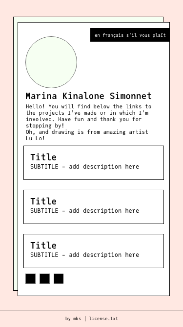
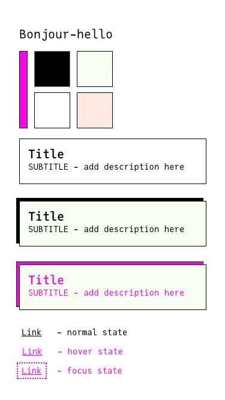

# Bonjour Hello

A linktree-like landing page for all my associated links to post on social media.
### Version 2 - march 2022
- new design, still focused on accessibility
- better HTML structure and naming conventions for CSS
- ...and of course, more confettis!

 |
---|
wireframe for mobile version |

 |
---|
Stylesheet |

## Built with 

- HTML
- CSS & SCSS (SASS)
- [Party.js](https://party.js.org/)

## What's next to do?
On March 2022, I decided to update my portfolio, blog and landing page for personal links with newly acquired knowledge about design and coding.
202203: V.2 has been deployed and I'm pretty much done with this project atm. Next step is to make some improvments to my portfolio :)
## What I have learned from this project
Keep things simple! Sometimes, the combo HTML+CSS is more than enough...
## Team

 |
---|
[Marina Kinalone Simonnet](https://github.com/marinakinalone) |

## [License](https://github.com/marinakinalone/kinalonedev/blob/main/LICENSE.txt)

MIT © [Marina Kinalone Simonnet](https://github.com/marinakinalone)

